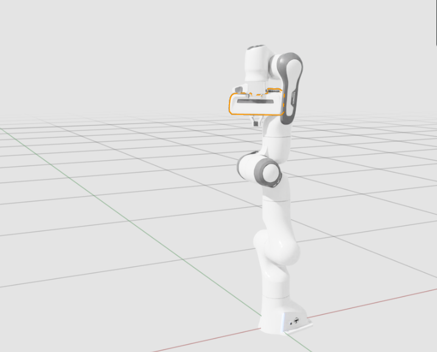
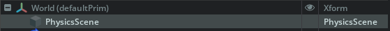

# Isaac Sim 学习

## 基本知识：

### 1.  Create 创建

#### （1）Light（光影操作）：

- 增加环境天光（Dome Light）：【使环境变白】

  ```
  Create -> Light -> Dome Light
  ```

  效果：

  

#### （2）Physics（物理）：

- Physics Scene（创建物理场景）

  - 作用：创建一个 物理世界，引入 **重力和碰撞**

  - 操作：

    ```
    Create -> Physics -> Physics Scene
    ```

  - Stage：

    

- Ground Plane（创建物理地面）：

  - 作用：创建 **无限延伸的网格灰色地板**

- 


## 操作：

### 1.  启动 Isaac Sim

#### 方法一：Shell 命令行启动

```shell
# 加载ROS2环境
source /opt/ros/jazzy/setup.bash

# 设置设置 ROS 域 ID 和 
export ROS_DOMAIN_ID=0
export RMW_IMPLEMENTATION=rmw_fastrtps_cpp    
    
# 进入 文件夹
cd ~/Applications/isaacsim
# 运行 Isaac Sim
./isaac-sim.sh
```


### 2. GUI方式使机械臂动起来

#### 方法一：鼠标拖动机械臂：

1. 首先，将 光影、物理场、物理地面 都加入
2. 点击 Play 开始仿真
3. 按住 `Shift` 不松开，鼠标左键按住机械臂的任意位置（比如手部），**用力往外拖拽**。

#### 方法二：用 **OmniGraph Controllers**

1. 打开图表生成器：

   `Tools -> Robotics -> OmniGraph Controllers -> Joint Position`

2. 在新弹出的关节位置控制器输入窗口中，点击`Add`：添加**机器人根节点franka**

3. 点击 OK 

4. 在右上角的场景选项卡中，选中：

   `Stage -> Graph -> Position_Controller`

5. 点击`JointCommandArray`节点：在右下角的属性选项卡`Property`中，可以查看关节指令数值。构造数组节点下的输入项对应机器人上的各个关节，从基座关节开始。

6. 开启 仿真

7. 按住并拖动各类数值输入框，或者输入不同数值，即可观察机械臂位置发生变化。

#### 方法三：用 Action Graph 控制图

1. 打开 控制图：

   `Window > Graph Editors > Action Graph`

2. 在 下栏，选择：`Edit Action Graph`

3. 从列表中选择唯一存在的图表。

4. 选择一个 数组`Array`，查看`Stage`和`Property`

5. 选择 与 `Position Command`相连的`Array`

6. 在 `Property` 进行 控制

### 3. ROS2方式

准备工作：先用**GUI**方式确定 机器人 能动 

#### 第一步：启用 ROS 2 Bridge

1. 进入 Isaac Sim 后：

   `Window -> Extensions -> ROS 2 Bridge`

2. 检查 ROS2 是否连接：

   - Isaacsim端：

     `Tools -> Robotics -> Ros 2 OmniGraphs -> clock -> 运行`

   - ROS2端：

     `ros2 topic list`：查看是否输出`/clock`

     `ros2 topic echo /clock`：查看是否有输出
